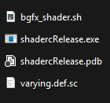
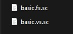

# ⛱️ Shader Processor
Shader Processor is a header only library for BGFX based projects, It is used to automate the shader compiling process for converting `.sc` files to `.bin` which can be then included into your project.  
This Library also takes into account the last modified date of your shader source files and skips already compiled shaders. This function library is best used as tool before starting up your engine, it will go through the given directory and extract all the shader files and compile them into a binary folder of your choosing.  

This system uses modern C++ features and File system.  

For logging this function library also provides a function hook which by default outputs to console using iostream (`std::cout`) that function can be pointed to your own custom logger if needed.  
`inline std::function<void(std::string_view)> log`  

## 📋 Function List

| Function                  | Description      |
| -------------             | ------------- |
| `processShaders`          | Processes the shader from their raw `.sc` form to `.bin` format                           |
| `findShaderFiles`         | Finds all regular files under the given directory path.                                   |
| `detectShaderFileType`    | Stems the file extension and detects the type of shader based on filename.                |
| `runProcess`              | Creates a `shaderc` process with arugments (Windows Only, internal function)              |
| `shaderTypeToWString`     | Converts Enum `ShaderFileType` to WString (internal)                                      |

## Input And Output

Before calling your own function you would need to have 3 things:
- Path to your shader tool directory.
- Path to your shader binary directory (output).
- Path to your shader source directory (input).

In Your shader tool folder you would have all the BGFX `shadercRelease.exe` related files, this includes files like:
<div align="left">
  
</div>

Your source (input) folder should only contain the shader files you have written:
<div align="left">
  
</div>

The important thing to note here is the filename and extension.
Your regular BGFX shaders have extension `.sc` for shader processor library we add an identifier before it which lets our program know which type of shader it is so:
| Shader Type               | Identifier                |
| -------------             | -------------             |
| Vertex                    | `filename.vs.sc`          |
| Fragment                  | `filename.fs.sc`          |
| Geometry                  | `filename.gs.sc`          |
| Tessellation              | `filename.ts.sc`          |

## Example Code
This Repository also comes with an example file which processes the shaders and then creates a dummy headless BGFX application.
```
  // discover shader files in shader source folder
  const auto& files = shader::processor::findShaderFiles(std::filesystem::path(SHADER_ROOT_PATH));
  // process and create output in shader output folder
  shader::processor::processShaders(files, SHADER_BIN_PATH, SHADER_TOOL_PATH,L"windows", L"120");
                                    